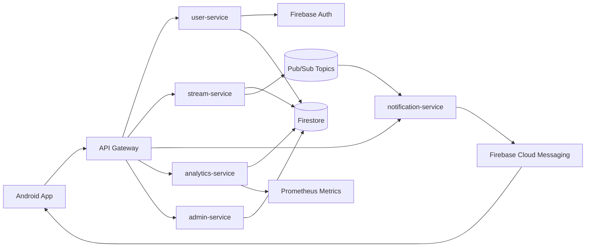
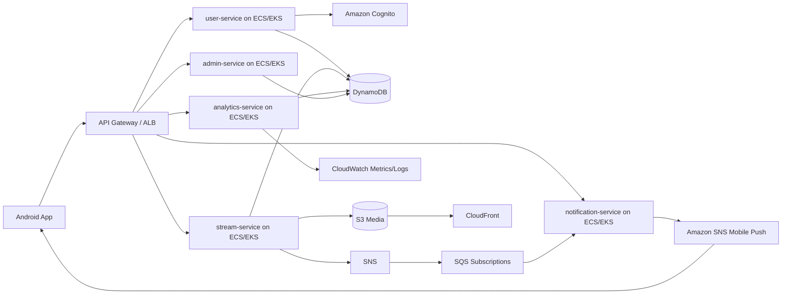

# Architecture Evolution (CCC'26)

This document captures architecture progression and target migration architecture for final jury submission.

## Initial to Current Evolution Summary

- Initial concept: mobile app with backend API.
- Current implemented architecture: gateway + multiple Go microservices + Pub/Sub + Firestore + Firebase Auth/FCM.
- Key change rationale: separate concerns, improve reliability, support burst traffic, and simplify public ingress.

## Current Implemented Architecture

## Target AWS Migration Architecture

