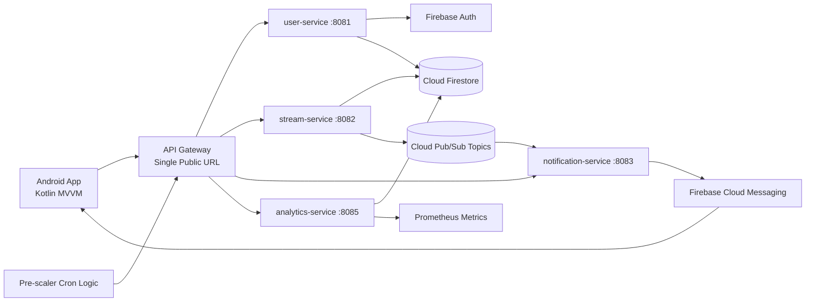

# Sports Stream Platform - Implementation Report (CCC'26)

**Team Project:** Cloud Computing Competition 2026 (CCC'26)  
**Date:** April 2, 2026  
**Project Type:** Distributed cloud-native sports streaming platform

## 1. Project Overview

The Sports Stream Platform is a cloud-based system that enables users to discover, join, and follow live sports streams with real-time notifications and analytics. The main goal was to design a meaningfully distributed architecture (not a single app + single API), implement role-based access, and demonstrate scalability under high viewer traffic.

Our final solution uses a microservice architecture in Go, a mobile client in Android (Kotlin), Firebase services for identity and messaging, and Google Cloud components for managed eventing and data storage. Services are deployed behind a single API gateway and communicate through both HTTP and Pub/Sub events.

### Problem We Solve

Sports content audiences are highly bursty: a stream can go from almost zero viewers to thousands in a few seconds. Traditional monolithic systems can become costly when always-on and fragile during spikes. We solve this by combining:

- Independent microservices with clear responsibilities
- Event-driven communication for asynchronous workflows
- Pre-scaling and scale-to-zero logic for cost efficiency
- Real-time push notifications for user engagement

## 2. Implemented System and Components

### 2.1 Backend Microservices (Go)

We implemented and deployed the following services:

- **user-service (:8081):** authentication integration, profile management, and role checks.
- **stream-service (:8082):** stream CRUD, join/leave actions, and HLS session handling.
- **notification-service (:8083):** Pub/Sub consumer and Firebase Cloud Messaging (FCM) push notifications.
- **analytics-service (:8085):** Prometheus metrics, stream statistics, and observability endpoints.
- **pre-scaler:** scheduled scaling logic (Kubernetes CronJob design) to reduce cold starts during expected demand.
- **API gateway:** single public entry point with path-based routing for all backend services.

### 2.2 Shared Platform Packages

To keep services consistent and production-ready, we created reusable packages:

- **pkg/middleware/auth.go:** JWT/Firebase token validation and authorization middleware.
- **pkg/firebase/client.go:** Firebase credential loading from JSON file path or JSON string (local, Docker, and cloud friendly).
- **pkg/pubsub/client.go:** graceful publish/subscribe handling for event-driven communication.
- **pkg/util/env.go:** environment loading without additional startup complexity.

### 2.3 Data and Messaging

- **Firestore** stores users, streams, matches, and analytics data.
- **Cloud Pub/Sub** handles decoupled events such as stream start/stop and notification triggers.
- **Firebase Auth** provides sign-up/sign-in and identity management.
- **Firebase FCM** sends push notifications to mobile clients via topics.

### 2.4 Mobile User Interface

The Android client (Kotlin MVVM) includes:

- Google Sign-In authentication
- Stream list view and pull-to-refresh home screen
- ExoPlayer-based HLS playback
- Profile screen with role and account details
- WorkManager-based leave-stream reliability when app is terminated
- FCM notification handling for stream and match events

This fulfills the "normal user" interface requirement with a practical end-user experience.

### 2.5 Admin User Interface

The backend repository now includes a dedicated admin service and web interface with:

- Admin login/logout with signed session cookie
- Dashboard and system health visibility
- CRUD operations for users, streams, analytics, and matches
- Notification trigger actions from admin panel

This fulfills the "admin user" interface requirement directly in the deployed backend stack.

## 3. Current Architecture Diagram

## 4. Key Requirement Coverage (Implemented)

### Identity and Access Management

Implemented with Firebase Auth and role-based authorization. Roles include viewer, broadcaster, and admin-level logic. Access control is enforced in backend middleware, and restricted operations (for example stream creation) correctly return 403 for unauthorized roles.

### Architecture and Distribution

The architecture is meaningfully distributed: multiple Go services, separate responsibilities, shared data layer, event bus, gateway, and background scaling logic. This goes well beyond a simple frontend + single API design.

### Scalability and Load Testing

We designed for elastic demand handling with two levels:

- Horizontal scaling configuration (HPA design with multiple metrics)
- Pre-scaler logic for demand-aware warm-up and scale-to-zero behavior

A `k6` load test script is prepared and executed with high-concurrency traffic profiles (up to 5000 concurrent viewers scenario) to validate response behavior under stress.

### Monitoring and Observability

`analytics-service` exposes metrics and tracks stream activity. The system includes practical observability signals and Prometheus-compatible endpoints to support health checks, trend analysis, and incident detection.

### Security

Protected routes require valid authentication tokens. IAM roles for Pub/Sub publisher/subscriber operations follow least-privilege intent. Security is integrated at gateway and service levels.

### Build vs Managed Decisions (Summary)

We deliberately chose managed services for high-operational-burden components and built custom logic where domain behavior is specific:

- **Managed:** Firebase Auth, FCM, Firestore, Pub/Sub (faster delivery, reliability, lower ops burden)
- **Built by team:** domain microservices, gateway routing, business rules, stream session logic, analytics endpoints, and scaling policy logic

This mix lets the team focus engineering effort on product value rather than re-implementing commodity infrastructure.

## 5. Deployment and Operations Status

### Production-Style Deployment

Core services and gateway are live on Scalingo under one public backend URL. A `start.sh` strategy runs gateway and services in one deployment unit for simple operation and demo stability.

### Multi-Platform Progress

- Scalingo: active for main backend stack
- Fly.io: partially tested
- Render: configuration prepared
- Cloud Run/GKE: planned as final improvement (billing-dependent)

### Dev and Test Tooling

- Postman collection with 40+ requests (local + production)
- End-to-end auth token workflow
- k6 stress script for concurrency testing

## 6. What Changed from Initial Direction

As the project evolved, we refined architecture and priorities based on demo reliability and team capacity:

- We prioritized reliable distributed backend operation first, then client integration.
- We introduced gateway centralization to simplify public access and route management.
- We moved to managed Firebase/GCP components to reduce undifferentiated operations work.
- We added pre-scaling and observability features to better handle burst traffic and provide measurable system behavior.

These changes improved practical deployment readiness and competition demo robustness.

## 7. Remaining Work Before Final Jury Demo

The platform core is implemented and functioning, but several competition deliverables are still in progress:

- Firestore security rules file is now added in-repo, but still must be deployed and validated in Firebase.
- FFmpeg + GCS full HLS pipeline should replace temporary test stream setup.
- Android production BASE_URL update must be applied in the Android repository (not present in this backend repository).
- Terraform baseline configuration is now added in-repo, but full apply evidence is still pending.
- Load-test evidence screenshots and final architecture submission assets should be attached for jury review.

## 8. Additional Deliverables Added (April 2, 2026)

To close CCC'26 documentation and compliance gaps, the following artifacts are now included in this repository:

- `firestore.rules`: role-aware Firestore security rules baseline.
- `docs/pricing-scenarios.md`: idle, 1K, 10K, and 100K workload cost scenarios.
- `docs/aws-migration-analysis.md`: GCP-to-AWS service mapping and migration plan.
- `docs/build-vs-managed.md`: formal rationale for build-vs-managed service decisions.
- `infra/terraform/`: Terraform baseline configuration and usage guide.
- `k8s/deployments.yaml` and `k8s/hpa.yaml`: Kubernetes deployment and autoscaling manifests.
- `scripts/deploy-all.sh`: end-to-end build/deploy helper script with health verification.
- `.env.example`: sanitized environment template for local and CI use.

## 9. Conclusion

The Sports Stream Platform already demonstrates the core of a modern cloud-native distributed system: role-aware identity, microservice decomposition, event-driven messaging, mobile user experience, observability, and load-oriented design.

From a CCC'26 perspective, the implementation is technically strong in backend architecture and real-world cloud integration. Completing the final documentation and security/admin deliverables will make the submission not only functional, but fully aligned with all competition requirements.
